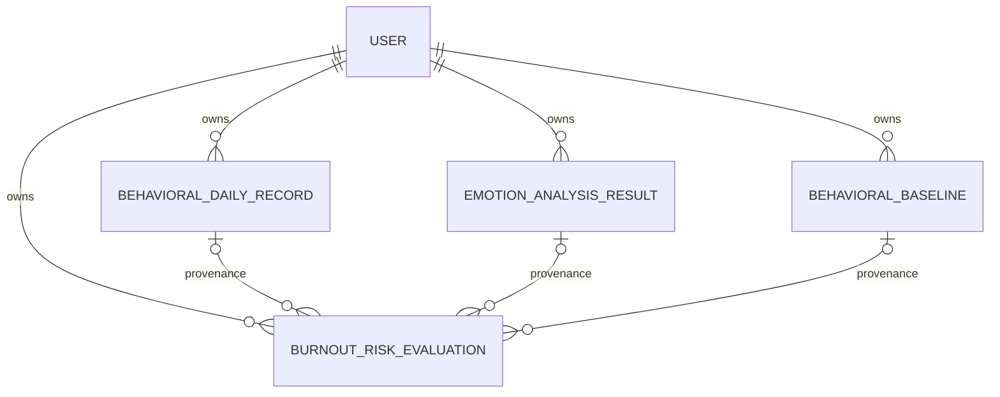

# Behavioral persistence

This layer stores daily behavioral signals, derived emotion probabilities,
versioned personal baselines, and immutable burnout-risk evaluations. It does
not expose FastAPI routes, call the AI service, or change the risk rules.

The burnout score is an explainable product signal and is not a medical
diagnosis.

## Entities and relationships



- `behavioral_daily_records` stores at most one row per user and local date.
  Minute fields are nullable and constrained to `0..1440`; steps and schedule
  counts are non-negative. Because the shared JSON Schema does not define a
  maximum for those integers, `steps` and `schedule_count` use an exact
  text-backed integer type rather than a 64-bit database integer; the ORM
  still exposes Python integers. Daily `subjective_fatigue` is non-negative
  without an assumed scale maximum, while the legacy internal
  `subjective_stress` remains `0..10`. `timezone` preserves the date boundary
  used by the producer. Whole-second local `bedtime` and `wake_time` values
  are stored without UTC offsets.
- `emotion_analysis_results` stores the complete six-label probability
  distribution, confidence, uncertainty, model version, and an optional
  irreversible input hash. It never stores the input text.
- `behavioral_baselines` is append-only and records its exact window,
  `sample_days`, status, and algorithm version. Multiple historical versions
  may coexist.
- `burnout_risk_evaluations` is append-only. It stores the complete versioned
  engine response: score, level, quality flags, category scores, factors, and
  summary. Re-evaluating the same inputs creates another audit row instead of
  overwriting history.

New enums use portable bounded strings with check constraints rather than new
PostgreSQL native enum types. The existing `UserType` enum and its migration
are unchanged.

These ORM rows are not replacements for the existing behavioral or baseline
wire contracts. DB-only identity, provenance, and timestamp fields remain
internal, while explicit adapters handle naming differences such as
`study_work_minutes` versus `work_or_study_minutes`.

Daily records also store the shared `source_by_field` and `coverage_by_field`
objects as portable JSON. The API validates their closed key sets, enums, and
value/coverage invariants before persistence. The older scalar `source` and
`data_completeness` columns remain internal for compatibility and are not
substitutes for field-level metadata.

## Privacy and retention

Emotion text is deliberately absent from both the model and migration. The
optional `input_hash` is for duplicate investigation only; callers must use a
one-way digest (preferably a keyed HMAC under a separately managed key) and
must not encode recoverable text in it. Model and engine versions are retained
so historical results remain interpretable.

Deleting a user cascades to all four owned data sets. Deleting an individual
daily record, emotion result, or baseline sets the corresponding evaluation
provenance FK to `NULL`; the historical evaluation remains. A future
user-data-deletion workflow must execute and verify the full user cascade.

Behavioral and emotion data must not be reused for calibration, analytics, or
model training without a separate consent and retention policy.

## Baseline policy

`behavioral-baseline-mean-v1` uses an inclusive 14-day window by default and
allows explicit windows from 14 through 28 days. It:

- excludes future dates;
- counts distinct dates with at least one behavioral or valid emotion signal;
- excludes missing values from each metric's denominator;
- selects the latest emotion result for a date;
- averages negative-emotion probability as `1 - P(기쁨)`;
- rounds persisted means to four decimal places;
- creates `ready` at seven or more sample days and `insufficient` otherwise.

An insufficient row is persisted for provenance and is passed to the risk
engine with its actual `sample_days`, allowing the engine to return a
provisional result. No row represents a missing baseline.

## Repository and transaction policy

Repositories require `user_id` for reads, add objects, and call `flush()`.
They never commit or roll back. The caller owns the transaction and can
atomically persist an emotion result, evaluation, and related work. ORM
entities are not API contracts.

The risk adapter maps:

- DB `study_work_minutes` to domain `work_or_study_minutes`;
- all six emotion probabilities, confidence, and uncertainty;
- nullable behavioral fields without imputation;
- baseline values and actual `sample_days`.

It performs no unit conversion or audience/profile inference.

## Migration

From `services/backend`, after selecting and backing up the intended database:

```powershell
python -m alembic current
python -m alembic upgrade head
```

POSIX shell:

```sh
python -m alembic current
python -m alembic upgrade head
```

Revision `20260725_0002` must follow an accurately stamped or migrated
`20260725_0001`; revision `20260727_0003` then adds the shared Daily Record
storage fields and constraints. Do not run these against an unknown
`create_all()` database.

Revision `0003` leaves the two field-level metadata columns nullable at the
database layer so existing rows are not assigned invented provenance. New API
writes always supply both complete objects. A deployment with pre-existing
daily records must apply an explicitly approved provenance/coverage backfill
before those rows can be serialized through the shared response contract.
Until that backfill is complete, an attempted shared-contract read returns
`503` rather than inventing metadata or leaking an internal validation error.
Downgrading `0003` is rejected before any schema change when a row contains
data in a `0003`-only column, `subjective_fatigue > 10`, or a
`schedule_count` outside the signed 32-bit range that revision `0002` can
represent. Those values must be resolved or exported explicitly.
Review PostgreSQL's existing `usertype` enum separately; this revision does
not modify it.

Recommended rollout:

1. Back up and audit the existing `users` schema and Alembic revision.
2. Apply revision `0002` in a disposable or staging database.
3. Verify constraints, indexes, FK delete actions, and application rollback.
4. Deploy application code and migration in the approved order.
5. Roll back only by stopping writers first and downgrading to `0001`; the
   downgrade drops all four persistence tables and their data.

Tests always use temporary SQLite databases with foreign-key enforcement.
They never connect to a developer, shared, or production database.

## Follow-up integration

The daily-record, emotion-orchestration, baseline, and risk-evaluation APIs are
now layered on this persistence model. Explicit user-deletion workflows and a
consented calibration pipeline remain outside this persistence change.
